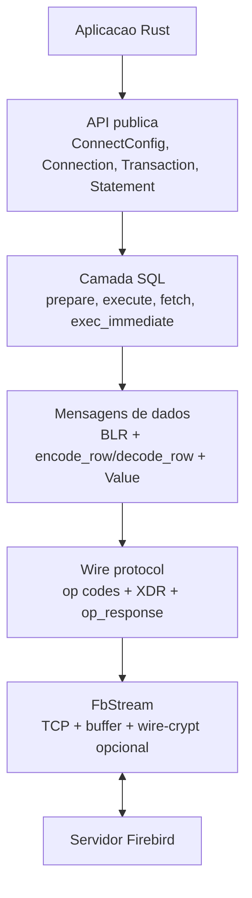
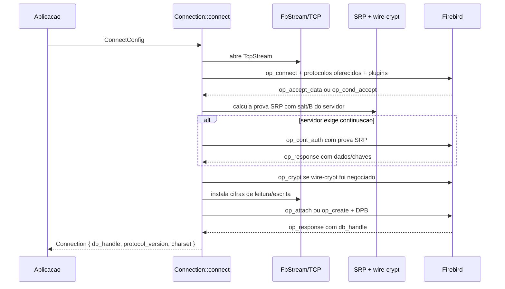
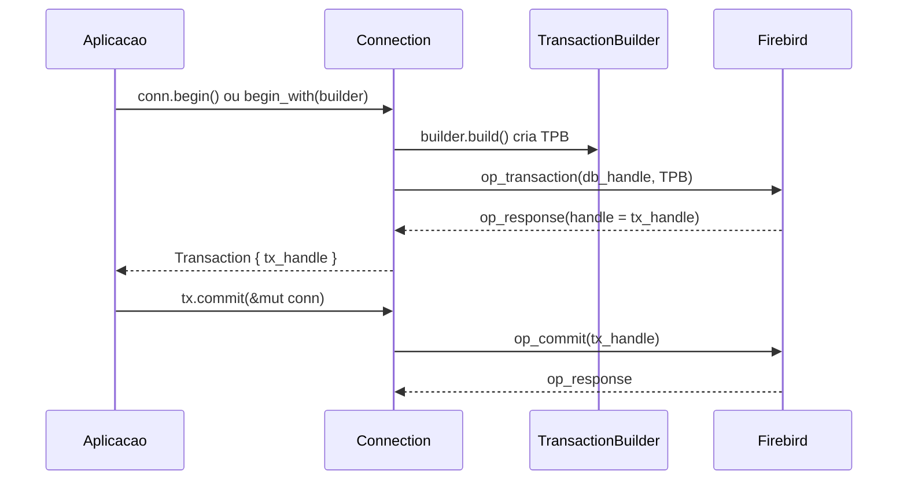
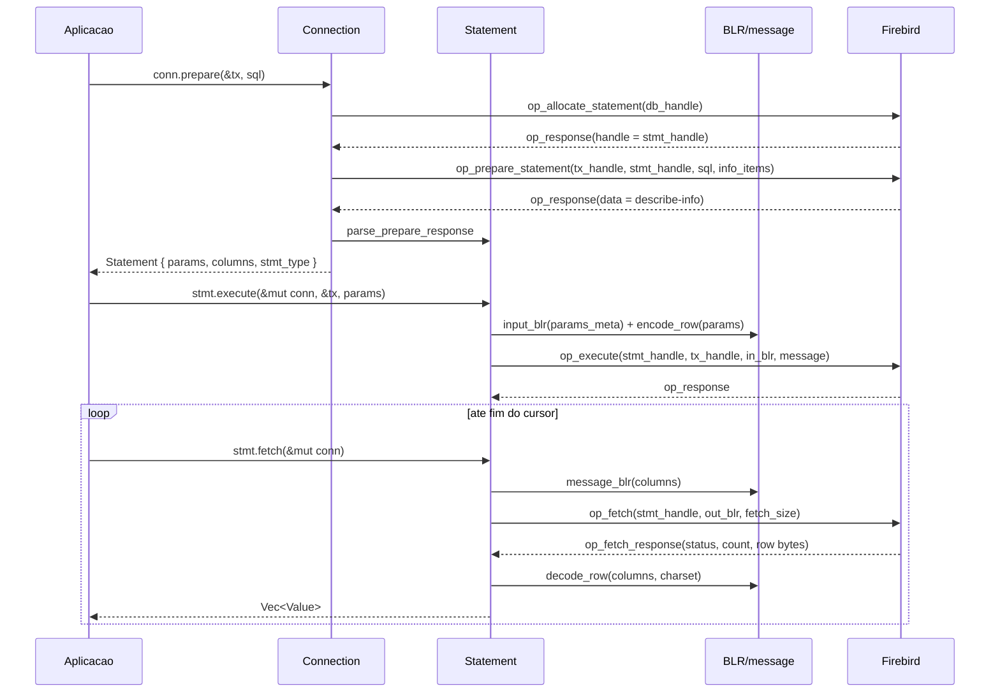
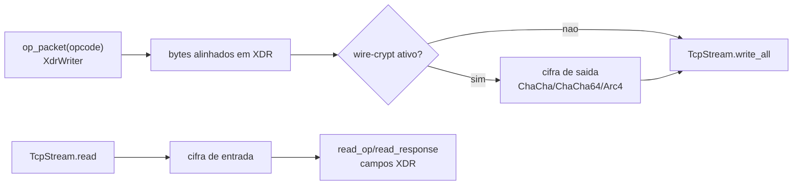
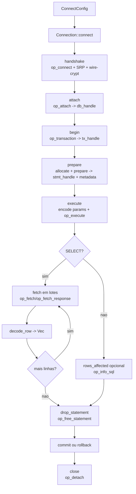
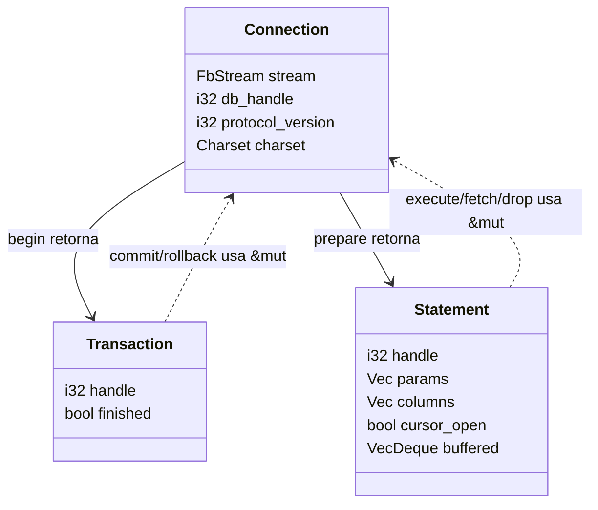

# Diagrama interno do `firebird-wire`

Este documento mostra o caminho de uma operacao comum no driver: abrir conexao,
autenticar, iniciar transacao, preparar SQL, executar, buscar linhas e fechar os
handles do servidor.

## Visao em camadas



| Camada | Arquivos principais | Papel |
| --- | --- | --- |
| API publica | `connection.rs`, `transaction.rs`, `statement.rs`, `config.rs` | Expoe os tipos usados pela aplicacao. |
| SQL/handles | `statement.rs`, `transaction.rs` | Mantem handles retornados pelo servidor e envia operacoes DSQL. |
| Mensagens | `blr.rs`, `message.rs`, `value.rs`, `charset.rs` | Descreve formatos com BLR e converte `Value` para/de bytes. |
| Wire | `wire/consts.rs`, `wire/xdr.rs`, `wire/response.rs` | Monta op codes, campos XDR e interpreta `op_response`. |
| Transporte | `wire/stream.rs`, `auth/wirecrypt.rs` | Le/escreve no TCP, aplica criptografia quando negociada. |
| Autenticacao | `auth/srp.rs`, `connection.rs` | Faz SRP/Srp256 e deriva chave de sessao para wire-crypt. |

## 1. Conexao e attach



Pontos importantes:

- `Connection::connect` chama `handshake`, que envia `op_connect` com as versoes
  de protocolo suportadas e dados de autenticacao inicial.
- O servidor escolhe versao/plugin e devolve dados SRP. O driver calcula a prova
  sem enviar a senha em claro.
- Se `WireCrypt` estiver habilitado e houver chave de sessao, o driver negocia a
  cifra e instala os cifradores em `FbStream`.
- Depois do handshake vem o attach real: `op_attach` com o DPB. A resposta traz o
  `db_handle`, que identifica o attachment no servidor.

## 2. Transacao



Toda query preparada roda dentro de uma transacao. O `Transaction` guarda apenas
o `tx_handle`; quem possui o socket continua sendo a `Connection`. Por isso os
metodos recebem `&mut Connection`: o driver garante que uma unica operacao use o
fluxo TCP por vez.

## 3. Query preparada: prepare, execute, fetch



O `prepare` retorna dois conjuntos de metadados:

- `params`: tipos esperados para os `?` do SQL.
- `columns`: tipos das colunas retornadas por um `SELECT`.

No `execute`, os parametros viram uma mensagem compacta:

```text
bitmap de NULLs (little-endian, alinhado em 4)
valor 0 em XDR, se nao for NULL
valor 1 em XDR, se nao for NULL
...
```

No `fetch`, o caminho e inverso: o servidor envia bytes de linha em
`op_fetch_response`, e `decode_row` converte cada campo para `Value`.

## 4. O que trafega no socket



`FbStream` nao usa um envelope unico com tamanho total do pacote. Cada `op code`
tem seu proprio layout, entao a leitura consome campos na ordem esperada:
`read_i32`, `read_bytes`, `read_quad`, padding XDR e assim por diante. Se chega
um pacote inesperado onde o driver esperava `op_response`, o stream e marcado
como quebrado para o pool nao reutilizar uma conexao fora de sincronia.

## 5. Ciclo completo comum



## 6. Handles e dono real do I/O



`Transaction` e `Statement` nao possuem socket. Eles sao referencias logicas a
objetos do lado do servidor. O socket fica em `Connection`, e por isso qualquer
operacao que precise falar com o servidor recebe `&mut Connection`.

## 7. Fechamento correto

Ordem recomendada no caminho comum:

1. `stmt.drop_statement(&mut conn)` para liberar o statement no servidor.
2. `tx.commit(&mut conn)` ou `tx.rollback(&mut conn)` para finalizar a transacao.
3. `conn.close()` para enviar `op_detach` e fechar o attachment.

Em builds de debug, `Drop` avisa quando `Statement` ou `Transaction` sao
descartados sem fechamento explicito. Isso ajuda a detectar handles esquecidos
do lado do servidor.
